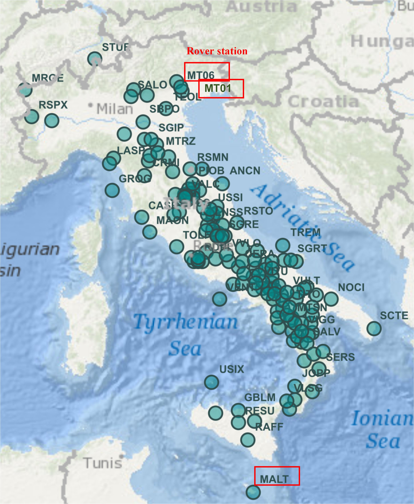
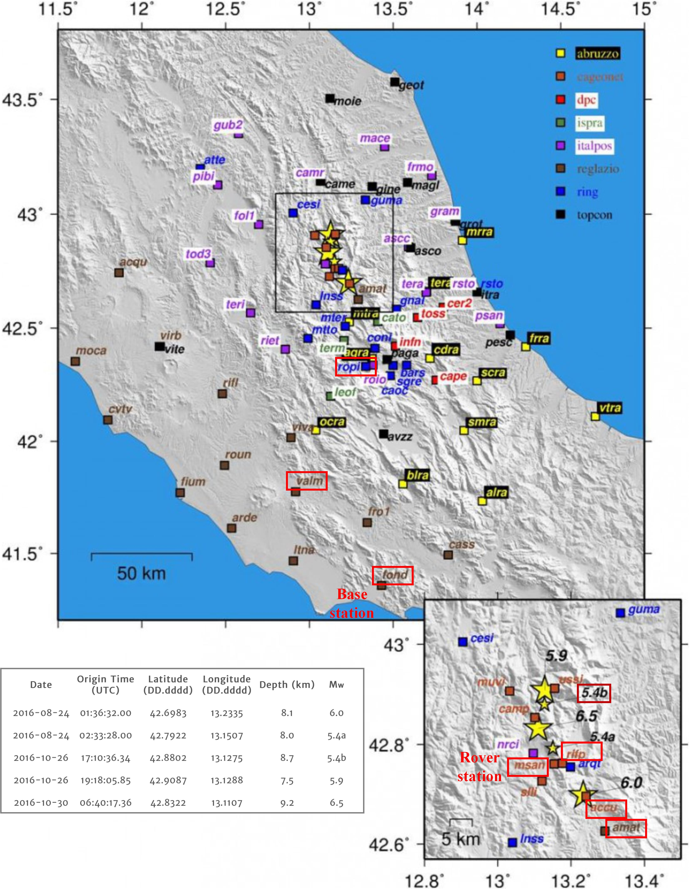

# GNSSLab
Repository for GNSS Lab (2020FS) @ ETHZ

Project members: Han Sun, Yue Pan

## Dataset
[RING Itatly](http://ring.gm.ingv.it/?p=1333)


#### Static (low frequency)



```
Frequency: 1/30 Hz
Duration:  //2016(DOY200) 
Rover station: MT06
Base station: from shortest to longest baseline
MT01 (~9km)
MALT (~1400km)
```

#### Static (high frequency)



```
Frequency: 1 Hz (original 10Hz)
Duration: 1/11/2016(DOY306) 09:00-13:00
Rover station: MSAN
Base station: from shortest to longest baseline
RIFP (~1km)
ACCU (~8km)
AMAT (~20km)
ROPI (~50km)
VALM (~110km)
FOND (~170km)
```

#### Dynamic ("5.4b" Earthquake of October 26, 2016, very high frequency) 
```
Frequency: 10 Hz
Duration: 26/10/2016(DOY300) 15:00-19:00 (earthquake at 17:10)
          24/10/2016(DOY298) 15:00-19:00
Rover Station: station closest to the center of earthquake, MSAN (~10km)
Base Station: station farthest from the center of earthquake, FOND (~175km)
```

## Softwares
1.RNXCMP: uncompressing and format transformer (like crx2rnx)

[software](https://terras.gsi.go.jp/ja/crx2rnx.html) [blog](http://blog.sciencenet.cn/blog-1217335-1010460.html)

2.TEQC: preprocessing routine

[software](https://www.unavco.org/software/data-processing/teqc/teqc.html) [blog](http://wap.sciencenet.cn/home.php?mod=space&uid=3391834&do=blog&id=1151091)

3.RTKLib: RTK with different baseline distance

[code](https://github.com/tomojitakasu/RTKLIB) [blog](https://zhuanlan.zhihu.com/p/78359579)

4.PPPWizard: Realtime PPP

[code]()

5.WHU Pride PPPAR: PPP post processing (as ground truth)

[code](https://github.com/YuePanEdward/PRIDE-PPPAR) [blog](https://zhuanlan.zhihu.com/p/101144206) 

6.GPS toolboxs: other useful softwares

[link](https://www.ngs.noaa.gov/gps-toolbox/)  such as GAMP

## General Idea
  
  Compare the performance of Realtime PPP with RTK for static and dynamic data with different baseline length.
  
  First, analyze static data (no earthquake): Look for two stations, that are closest, and compute short baseline solutions with RTKLIB. Then take stations each at a distance of few tens of km, hundret km, and maximum distance away (around 180 km). Use these as base stations, and compute baseline solutions to the rover station of your choice. First of all, I would try 1 Hz data, and then test higher rates. The datasets should have a length of 2-3 hours or so (convergence time will be needed).
  
  Concerning the first step: you will have to convert the data, that is in RINEX Hatanaka compressed format, to standard RINEX observation files. For baseline lengths of tens of kilometers and more, you will have to use the RTKLIB setup as documented in the RTKLIB long-baseline paper (see repository). You may also analyze the data (skyplot, multipath etc) with some basic tools (RTKLIB, teqc).
   
  Secondly, compute PPP solutions for the rover station: use the PPPWizard software, and also the postprocessing PPP software from Wuhan. Compare the PPP solutions with the solutions from the baseline processing. For seismic applications, it is more important to have good estimates of the displacement -- it is not the absolute coordinates that matter that much. So we can basically de-mean the timeseries for a noise comparison. (Nevertheless, biases are interesting too, especially if we compare the PPP solutions). 
  
  For dynamic data, we would focus on the 5.4 Mw ("5.4b") of October 26 (the reason for this is, that for others the base stations might be affected as well by the shaking). Take a rover station closest to the earthquake, and a base station the most distance away. Again, compute the PPP solutions for both the rover and the base and compare with the baseline solutions.
   Please make sure, that for the dynamic data, you have at least one hour of static data before the earthquake, since convergence time might be up to one hour or so (especially for the real-time PPP).

  Basically, it may be a good idea to process the static data and the dynamic data as a whole. That would then result in datasets of about 3-4 hours (Those might get pretty large for rates at 10 or 20 Hz). Concerning coordinate repeatability (and multipath effects), it would also be interesting to process the data of the day before (or even two days before). For the noise analysis, I would also tranform the ECEF coordinates to an ENU (east,north,up) coordinate system. As reference coordinates, you could use time-averaged coordinates from the PPP-PRIDE results, since these might be the most reliable ones, since they rely on the final orbit and clock products.

## Schedule
```
1. 4.21 Mid-term presentation
2. 5.29 Final presentation + report paper
```
